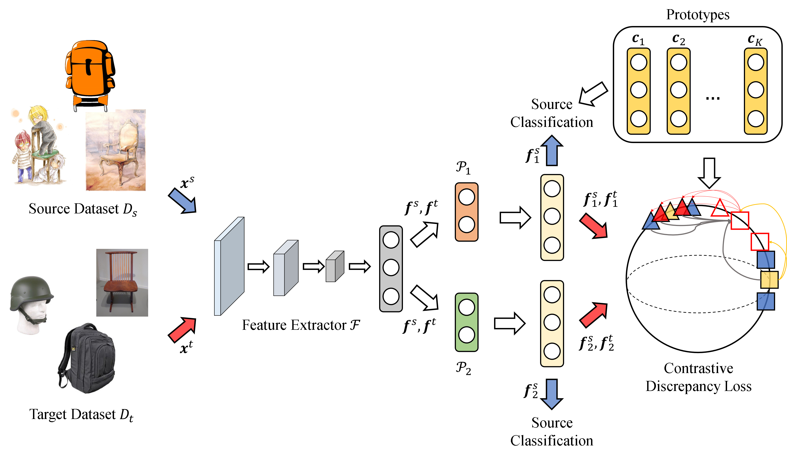

# Contrastive-Bi-Projector-for-Unsupervised-Domain-Adaption

## Abstract
<!-- [ABSTRACT] -->
This paper proposes a novel unsupervised domain 
adaption (UDA) method based on **contrastive bi-projector** (CBP), 
which can improve the existing UDA methods. It is called 
CBPUDA here, which effectively promotes the feature extractors 
(FEs) to reduce the generation of ambiguous features for 
classification and domain adaption. The CBP differs from 
traditional bi-classifier-based methods at that these two 
classifiers are replaced with two projectors of performing a
mapping from the input feature to two distinct features. These 
two projectors and the FEs in the CBPUDA can be trained 
adversarially to obtain more refined decision boundaries so that 
it can possess powerful classification performance. Two 
properties of the proposed loss function are analyzed here. The 
first property is to derive an upper bound of joint prediction 
entropy, which is used to form the proposed loss function, 
contrastive discrepancy (CD) loss. The CD loss takes advantages 
of contrastive learning and the bi-classifier. The second property 
is to analyze the gradient of the CD loss and then overcome the 
drawback of the CD loss. The result of the second property is
utilized in the development of the gradient scaling (GS) scheme in 
this paper. The GS scheme can be exploited to tackle the unstable 
problem of the CD loss because training the CBPUDA requires 
using contrastive learning and adversarial learning at the same 
time. Therefore, using the CD loss with the GS scheme overcomes 
the problem mentioned above to make features more compact for 
intra-class and distinguishable for inter-class. Experimental 
results express that the CBPUDA is superior to conventional 
UDA methods under consideration in this paper for the UDA and 
the fine-grained UDA tasks.

            

